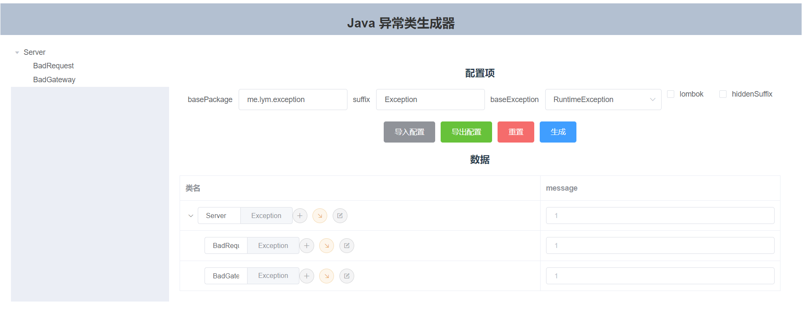

# java-exception-class-generator

Java异常类生成器是作者想到的对Java异常处理的一种实践的辅助工具，实践如下：
为每个项目都配置一套Exception，基异常为xxxAppException/xxxServerException，后续所有异常都从这个继承，基异常最好不要继承RunRuntimeException而是直接继承Exception。系统中抛出的异常都是自定义的Exception方便后续分辨程序运行是否超出控制。

在Java主要领域为Web和Android，而这两种都提供了一个全局catch未处理的异常的地方，我们只需要在这里分辨异常是不是自定义的即可。是自定义异常表明程序的运行还算正常，这个异常就是我们手动抛得，只是没出来或者是想统一处理；如果不是自定义异常那就表明程序运行已经超出我们控制发生意想不到的错误，这时候就可以通知紧急处理。

自定义异常也可以加一些属性，比如错误码，错误级别等等方便为统一处理提供更多信息。

该项目就是为生成异常类提供了一种更轻松的方式

作者主要写Java对前端实在是能力有限这段时间也在忙没时间完善，只是出了个原型，后续有时间完善

十分欢迎同好交流批评~

